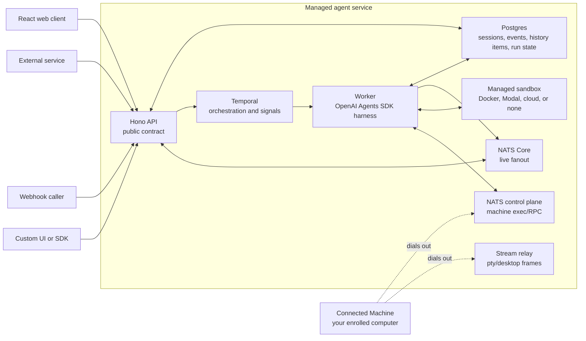

# OpenGeni

OpenGeni is a self-hostable managed agent service for long-running workspace and infrastructure work.

It provides a session-based API for creating, steering, observing, interrupting, and replaying agent runs. The included React app is one client for that API; other products can call the same API directly and let OpenGeni own durable session state, event history, approvals, and final outputs.

Every session picks where it runs. A **managed sandbox** (a fresh cloud box OpenGeni provisions and tears down) and a **Connected Machine** (a computer you enroll — your laptop, a build server, a GPU box) are co-equal, first-class compute targets. A machine-targeted session runs directly on your hardware, under your own files and your own git credentials, with no cloud box in the loop.

If you want to try the managed version, go to [app.opengeni.ai](https://app.opengeni.ai).

## What It Does

- Runs OpenAI Agents SDK agents behind a durable API.
- Streams live session events over SSE while storing the replayable event log in Postgres.
- Coordinates long-running work with Temporal signals for follow-ups, approvals, and interrupts.
- Runs each session on a chosen compute target: a managed sandbox (Docker, Modal, local, cloud provider, or none) or a **Connected Machine** you enroll — with a per-session working folder on that machine.
- Establishes a machine-targeted turn directly on the enrolled machine, using the machine's own git credentials — no cloud box is created and no OpenGeni-minted token is pushed to it.
- Attaches repositories, uploaded files, and document-search tools to sessions.
- Uses a GitHub App integration for scoped repository access.
- Supports document upload, indexing, retry, and semantic search with pgvector.

## Project Status

This repository is early, but it now includes the baseline files expected for public collaboration:

- Apache-2.0 license.
- Contribution guide.
- Security reporting guide.
- Code of conduct.
- Issue templates.
- Pull request template.
- CI for typechecks and unit tests.

## Public Preview / Security Boundary

OpenGeni's core API is workspace-scoped. Canonical protected routes include the workspace id in the URL, and every request resolves to an internal access grant before route code touches workspace-owned data.

There are three product access modes:

- `local`: local development bootstrap account/workspace, subject `dev`, broad permissions.
- `configured`: self-hosted or embedded deployments using configured deployment keys or delegated bearer tokens from a parent product.
- `managed`: OpenGeni owns email/password sign-up through Better Auth, workspaces, OpenGeni API keys, prepaid Stripe credits, usage, and limits.

The optional deployment shared-key boundary is still available for infra smoke tests and simple self-hosting. It uses `x-opengeni-access-key`, not `Authorization`. Product API keys and delegated tokens use `Authorization: Bearer ...`.

Do not expose a production deployment without a deliberate access mode, RLS-tested database role posture, rate limits, real model/sandbox credentials, and reviewed sandbox preparation policy. Sandbox preparation profiles and env allowlists can make host credentials available to agent sandboxes, so review `.env` before running live sessions.

## Architecture

Public clients talk only to the Hono API. The API validates requests, creates sessions, accepts user messages and control events, exposes durable history, and streams live events.



Managed sandboxes are provisioned inside the deployment. A Connected Machine is a computer you own: its agent dials **out** to the NATS control plane (for exec and control RPC) and to the stream relay (for terminal and desktop frames), so nothing has to be routable to the machine. Machine-target support is off by default and gated by an operator flag; see [Connected Machines](#connected-machines).

Postgres is the durable source of truth. NATS is only the realtime fanout bus. If an API instance or SSE client misses live events, the API backfills from Postgres by event sequence.

Temporal coordinates the work, but token streams and tool output do not go through workflow history. Agent execution runs inside non-retryable activities because model calls, sandbox commands, GitHub operations, and cloud-provider actions are side-effectful.

For a map of every app and package and how they fit together, see [docs/architecture.md](docs/architecture.md).

## Stack

- Bun workspace
- Hono API
- React and Vite web app
- Temporal worker
- Postgres with Drizzle and pgvector
- NATS Core realtime bus
- MinIO for local S3-compatible file storage and Azure Blob, AWS S3, or GCS for production object storage
- OpenAI Agents SDK
- Two co-equal compute targets: managed sandboxes (Docker, Modal, local, cloud providers, or none) and Connected Machines — computers you enroll and run sessions on directly (see [Connected Machines](#connected-machines) and [docs/architecture.md](docs/architecture.md) for the full list)
- A Rust agent + stream relay for Connected Machines (`agent/crates`), served to hosts by the control plane

## Agent Guides

Pair this README with the [CloudGeni Infrastructure Agents Guide](https://github.com/Cloudgeni-ai/infrastructure-agents-guide) for architecture patterns and operating guidance around infrastructure-focused agents, including repositories, sandbox tools, Terraform/Checkov skills, GitHub App access, and cloud credentials.

The capability catalog lets operators see and enable packs, MCP tools, APIs, skills, and plugins for the same runtime. See [docs/capabilities.md](docs/capabilities.md) for the unified catalog and [docs/packs.md](docs/packs.md) for the marketing social daily analysis pack.

## Quick Start

Prerequisites:

- Bun
- Docker
- OpenAI or Azure OpenAI credentials for real model runs

Start the full local stack:

```bash
bun run dev
```

`bun run dev` installs dependencies, creates `.env` from `.env.example` when missing, starts Docker infrastructure, runs migrations, builds the local sandbox image, and starts the API, worker, and web app.

Open:

- Web app: `http://127.0.0.1:3000`
- API health: `http://127.0.0.1:8000/healthz`
- NATS monitor: `http://127.0.0.1:8222`
- MinIO console: `http://127.0.0.1:9001`
- Temporal gRPC: `127.0.0.1:7233`

If you run Temporal with the local dev server instead of Docker Compose, the Temporal UI is commonly available at `http://127.0.0.1:8233`.

## Manual Startup

Use this when you want separate terminals for each long-running process:

```bash
bun install
docker compose up -d postgres nats temporal minio minio-init
bun run db:migrate
docker build -f docker/sandbox.Dockerfile -t opengeni-sandbox:local .
bun run dev:api
bun run dev:worker
bun run dev:web
```

## Configuration

Copy `.env.example` to `.env` and configure at least:

- `OPENGENI_DATABASE_URL`
- `OPENGENI_NATS_URL`
- `OPENGENI_TEMPORAL_HOST`
- `OPENGENI_STARTUP_DEPENDENCY_RETRY_*` if dependencies need longer startup windows
- `OPENGENI_OPENAI_PROVIDER`
- OpenAI or Azure OpenAI credentials
- `OPENGENI_SANDBOX_BACKEND`
- `OPENGENI_SANDBOX_PREPARATION_PROFILES` when sandbox credentials or lifecycle hooks are needed

If you are migrating from the pre-OpenGeni codebase, move the old `.env` aside and create a fresh one from `.env.example`; old `INFRA_AGENT_*` names are no longer read.

For local MinIO, keep S3-compatible storage and both object-storage endpoints:

```bash
OPENGENI_OBJECT_STORAGE_BACKEND=s3-compatible
OPENGENI_OBJECT_STORAGE_ENDPOINT=http://127.0.0.1:9000
OPENGENI_OBJECT_STORAGE_SANDBOX_ENDPOINT=http://minio:9000
OPENGENI_DOCKER_NETWORK=opengeni_default
```

The first endpoint is for the host, browser, and API. The sandbox endpoint is for Docker agent containers joined to the local Compose network, where `minio:9000` resolves to the MinIO service. Presigned URLs generated for one host are not safely interchangeable with the other because the host is part of the S3 signature.

`bun run dev` auto-selects alternate Docker Compose host ports when common defaults such as `5432` are already in use, and it rewrites the in-memory runtime URLs for that run. Set `OPENGENI_*_HOST_PORT` values in `.env` when you need fixed local ports.

For production deployments, use the native provider object store instead of running MinIO manually:

```bash
OPENGENI_OBJECT_STORAGE_BACKEND=azure-blob
OPENGENI_OBJECT_STORAGE_BUCKET=opengeni-files
OPENGENI_OBJECT_STORAGE_AZURE_CONNECTION_STRING=...
```

`OPENGENI_OBJECT_STORAGE_BUCKET` maps to the Azure Blob container. The API uses SAS URLs for browser upload/download and server-side reads for document indexing. Docker/local sandboxes mount Azure Blob through rclone; Modal sandboxes receive attached Azure Blob files through sandbox file materialization before the agent starts.

AWS S3 uses `OPENGENI_OBJECT_STORAGE_BACKEND=aws-s3` plus `OPENGENI_OBJECT_STORAGE_REGION`; prefer IRSA/EKS Pod Identity over static keys. GCS uses `OPENGENI_OBJECT_STORAGE_BACKEND=gcs` plus `OPENGENI_OBJECT_STORAGE_GCS_PROJECT_ID`; prefer GKE Workload Identity over service-account JSON. For AWS S3 and GCS file resources, OpenGeni materializes attached files in sandboxes through short-lived signed downloads.

For Modal runs, configure the Modal sandbox variables in `.env.example`. Private
registry images use `OPENGENI_MODAL_IMAGE_REGISTRY_SECRET`; the global
`OPENGENI_MODAL_IMAGE_REF` is warmed at worker boot, and pack-scoped
`sandboxImage` refs are warmed at turn time after pack settings resolve. The
registry Secret lookup uses the configured `OPENGENI_MODAL_TOKEN_ID` /
`OPENGENI_MODAL_TOKEN_SECRET` client, so embedded hosts do not need to also set
standard `MODAL_TOKEN_ID` / `MODAL_TOKEN_SECRET` env vars or provide a
`~/.modal.toml` profile.

## Deployment

The operator guide is in `docs/deployment.md`.

Current deployment artifacts include:

- A repo-owned deployment contract in `packages/deployment`.
- A Helm chart for API, web, worker, migrations, and disposable local/smoke fixtures at `deploy/helm/opengeni`.
- An Azure reference Terraform substrate at `deploy/terraform/azure`.
- AWS and GCP reference Terraform substrates at `deploy/terraform/aws` and `deploy/terraform/gcp`.
- Stack-wrapper plans that can install official upstream NATS and Temporal Helm charts outside the OpenGeni application chart.
- Runtime artifact generators for provider-specific non-secret Helm values and private runtime env files.
- A preflight/profile command:

```bash
bun run deployment:profiles
bun run deployment:preflight -- --profile azure-existing-services
bun run deployment:stack -- --profile gcp-managed
```

Production operators should use managed services, existing endpoints, or official upstream charts/operators for Postgres, Temporal, NATS, secret delivery, ingress/TLS, and observability. The in-chart Postgres, Temporal, NATS, and MinIO templates are only for local, CI, and smoke verification. Keep cloud resource inventories, generated credentials, kubeconfigs, Terraform state, and filled tfvars in private operator-controlled storage outside the repository.

## Web App

1. Start the stack with `bun run dev`.
2. Open `http://127.0.0.1:3000`.
3. Choose model and reasoning settings.
4. Answer **Where should this run?** — pick **Managed Sandbox** (a fresh box, set up for you) or **Connected Machine** (run on your own computer). Machine is offered only when the feature is enabled and you have at least one enrolled machine.
5. For a Connected Machine, pick the machine and its **Project / folder** — the per-session working directory the agent runs under (the machine root / its launch directory, or a subdirectory). A managed sandbox needs no folder choice.
6. Optionally attach repositories, files, or document search.
7. Send the first task.
8. Watch messages, tool calls, approvals, sandbox output, and final status. The session header's **Run on** control shows the active target and, when machines are enabled, lets you swap targets mid-session.
9. Send follow-ups, approve or reject tool requests, or interrupt the session.

Sessions are durable. Reloading the browser or opening the session URL later replays event history from Postgres and reconnects to live events.

### Enrolling a Connected Machine

When Connected Machines are enabled, enroll one from the workspace **Machines** dashboard (or from the composer's machine picker):

1. Click **Enroll a machine** and run the printed install one-liner on the computer you want to connect. It pulls the OpenGeni agent binary from the control plane and starts it.
2. Approve the machine. Two paths exist:
   - **Device flow (consent):** the agent prints a short code and a verification link; you open it and click **Grant** in the workspace to approve that specific machine. Approval is the loud, explicit consent step, and it records who approved.
   - **Zero-click enroll token:** mint a short-lived enroll token in the workspace ahead of time; the agent redeems it headlessly (the token is the grant, no per-machine click) — the path for scripted or fleet enrollment.
3. The machine appears in the dashboard with its status, OS/arch, and whether it offers a screen. You can revoke it at any time. Screen control is a separate opt-in granted at approval.

The agent dials **out** to the control plane, so the machine needs no inbound network exposure. See [Connected Machines](#connected-machines) for how an operator turns the feature on.

## Connected Machines

A Connected Machine is a first-class, co-equal alternative to the managed sandbox: instead of a cloud box OpenGeni provisions, a session runs on a computer you enroll and own.

How a machine session differs from a managed sandbox:

- **Runs directly on your machine.** A machine-targeted turn establishes the session on the enrolled machine directly — no cloud box is created or billed for that turn.
- **Your own git auth.** OpenGeni does not mint or distribute a repository token to the machine. Commands run under the machine's own local environment and its own git credentials. (For a managed sandbox, OpenGeni injects a short-lived, run-scoped git provider token when a GitHub, GitLab, or Azure DevOps broker is available; for a machine that injection is skipped.)
- **Your files, not a clone.** OpenGeni does not clone selected repositories onto the machine's real disk; the machine already owns its filesystem. The agent works in the per-session working folder you chose.
- **Per-session working folder.** Each session names a working directory on the machine (the machine root, or a subdirectory); it is the cwd base for the agent's exec, terminal, and file dock.

### Targeting machines from a custom client

Any client that speaks the OpenGeni API can target a machine:

- `POST /v1/workspaces/:workspaceId/sessions` (and the `session_create` MCP tool) accept `targetSandboxId` (the enrolled machine to run on) and `workingDir` (the per-session folder; only valid alongside `targetSandboxId`, and omitted means the machine's default working root).
- The React SDK ships a `@opengeni/react/machines` subpath with the machines dashboard, enrollment device-flow and consent components, status surfacing, and a `useMachines` hook.
- Enrollment is a small REST surface: agent-side device `start`/`poll` and headless token `exchange`, plus user-authenticated `approve`/`deny`, enroll-token mint, list, and revoke. All of it returns `404` while the feature is disabled.

### Enabling Connected Machines (operators)

The feature is **off by default**. While off, every enrollment and machine route returns `404` and the machine backend is inert — the surface does not exist for that deployment. Turning it on is provider-neutral:

- **The enable flag.** Set `OPENGENI_SANDBOX_SELFHOSTED_ENABLED=true`. This is the keystone that reveals the enrollment routes and activates the machine backend.
- **The relay component.** Deploy the stream relay (`opengeni-relay`, in `agent/crates`) as its own workload. A machine's agent dials out to it for terminal and desktop frames. Configure its listen address (`OPENGENI_RELAY_BIND`) and token secret (`OPENGENI_RELAY_TOKEN_SECRET`).
- **Control-plane endpoints handed to the agent.** Point the control plane at the NATS control plane the agent dials (`OPENGENI_SELFHOSTED_NATS_URL`) and the relay's base URL (`OPENGENI_SELFHOSTED_RELAY_URL`); these are returned to the agent as connect info at enrollment.
- **Signing secrets.** `OPENGENI_ENROLLMENT_SIGNING_SECRET` signs the enrollment credential the agent presents back; `OPENGENI_SELFHOSTED_RELAY_TOKEN_SECRET` signs the agent's relay producer token (the relay verifies it with the same secret, and it falls back to the stream-token secret when unset). Without these the credential and stream planes degrade gracefully rather than failing boot. Keep them in the deployment secret store; never log them.
- **Agent binary hosting.** The control plane serves the agent binary and install script under `/agent/*`; the install one-liner pulls from there. Nothing else needs to host it.

Provision NATS and the relay with your own managed services or upstream charts, as the rest of the stack recommends. Do not expose the machine feature without the relay-token and enrollment-signing secrets in place and rate limits on the enrollment routes.

## GitHub App Setup

The GitHub App integration is optional, but it is the recommended way to give agents scoped repository access. It lets the UI list installed repositories and lets the worker mint short-lived installation tokens only for repositories selected for a session.

From the web app:

1. Open the repository picker in the composer.
2. Expand **GitHub App**.
3. Optionally enter an organization login if the app should be created under an organization instead of your personal account.
4. Click **Create app**. The web app submits a GitHub App manifest to GitHub, and GitHub opens a prefilled app form.
5. Create the app in GitHub. The callback page prints `OPENGENI_GITHUB_APP_*` lines and includes a copy button.
6. Copy those lines into `.env`.
7. Restart the API and worker, or restart everything with `bun run dev`.
8. Install the app on the repositories the agent should access.
9. Refresh repositories in the picker and select repositories for the session.

For local development, the manifest callback can use the API origin from the running request. If you run behind a tunnel or deployed URL, set:

```bash
OPENGENI_GITHUB_APP_MANIFEST_BASE_URL=https://YOUR_DOMAIN
OPENGENI_GITHUB_APP_MANIFEST_STATE_SECRET=change-me
```

The generated app requests user authorization during install so OpenGeni can prove that the installer can access the installation before binding it to a workspace. First-release manifests do not register GitHub webhooks; repository listing, clone tokens, commits, pushes, and pull requests use installation access tokens.

The generated GitHub URL is only the manifest form target. Opening or copying that URL by itself only sends `state`, so GitHub shows an empty app form instead of the prefilled manifest.

## Documents And Knowledge

The Documents workspace supports document bases, file upload, indexing status, failed-document retry, and hybrid/vector/keyword search. Indexed documents can carry source metadata such as source kind, URI, title, author, version, timestamps, and ACL tags for retrieval filtering.

The workspace knowledge layer also includes reviewed memory records. Agents can search approved memories and propose new memories through the built-in docs MCP server. Human/API review happens through workspace knowledge memory endpoints before proposed memories become approved retrieval context.

Document indexing depends on:

- `OPENGENI_DOCUMENT_PARSER`
- `OPENGENI_DOCUMENT_EMBEDDING_PROVIDER`
- `OPENGENI_DOCUMENT_EMBEDDING_MODEL`
- `OPENGENI_DOCUMENT_EMBEDDING_DIMENSIONS`

DOCX/PDF parsing depends on the configured parser backend. If parser dependencies are missing locally, documents can fail indexing and later be retried from the UI after the dependency issue is fixed.

## Public API

Core endpoints:

- `GET /healthz`
- `GET /v1/config/client`
- `GET /v1/access/me`
- `GET /v1/workspaces`
- `POST /v1/workspaces`
- `POST /v1/workspaces/:workspaceId/sessions`
- `GET /v1/workspaces/:workspaceId/sessions/:sessionId`
- `GET /v1/workspaces/:workspaceId/sessions/:sessionId/events`
- `GET /v1/workspaces/:workspaceId/sessions/:sessionId/events/stream`
- `POST /v1/workspaces/:workspaceId/sessions/:sessionId/events`

GitHub endpoints:

- `GET /v1/workspaces/:workspaceId/github/app`
- `GET /v1/workspaces/:workspaceId/github/repositories`
- `POST /v1/workspaces/:workspaceId/github/repositories/sync`
- `POST /v1/workspaces/:workspaceId/github/app-manifest`
- `GET /v1/github/app-manifest/callback`
- `GET /v1/github/setup`

Document endpoints:

- `GET /v1/workspaces/:workspaceId/document-bases`
- `POST /v1/workspaces/:workspaceId/document-bases`
- `GET /v1/workspaces/:workspaceId/document-bases/:baseId/documents`
- `POST /v1/workspaces/:workspaceId/document-bases/:baseId/documents`
- `POST /v1/workspaces/:workspaceId/document-bases/:baseId/search`
- `POST /v1/workspaces/:workspaceId/document-bases/:baseId/documents/:documentId/reindex`
- `POST /v1/workspaces/:workspaceId/knowledge/search`
- `GET /v1/workspaces/:workspaceId/knowledge/memories`
- `POST /v1/workspaces/:workspaceId/knowledge/memories`
- `GET /v1/workspaces/:workspaceId/knowledge/memories/:memoryId`
- `PATCH /v1/workspaces/:workspaceId/knowledge/memories/:memoryId`

Connected Machine endpoints (all return `404` unless `OPENGENI_SANDBOX_SELFHOSTED_ENABLED=true`):

- `POST /v1/enrollments/device/start` (agent-side, unauthenticated)
- `POST /v1/enrollments/device/poll` (agent-side, unauthenticated)
- `POST /v1/enrollments/device/lookup`
- `POST /v1/enrollments/token/exchange` (agent-side headless enroll-token redemption)
- `POST /v1/workspaces/:workspaceId/enrollments/device/approve`
- `POST /v1/workspaces/:workspaceId/enrollments/device/deny`
- `POST /v1/workspaces/:workspaceId/enrollments/token` (mint a headless enroll token)
- `GET /v1/workspaces/:workspaceId/enrollments`
- `POST /v1/workspaces/:workspaceId/enrollments/:enrollmentId/revoke`

## Testing

Fast checks do not require Temporal, NATS, Postgres, a sandbox backend, or live model credentials:

```bash
bun run typecheck
bun test
```

Broader checks:

```bash
bun run test:integration
bun run test:e2e
bun run test:live
bun run check
bun run check:full
```

Integration and E2E tests use Bun's test runner. Deterministic SDK-level tests use a scripted model so they can exercise the real worker, Temporal workflow, NATS/SSE path, Postgres, and sandbox plumbing without depending on live model output.

## Development Notes

- Public clients should treat the API as the source of truth.
- Browser streaming uses `GET /v1/workspaces/:workspaceId/sessions/:id/events/stream`.
- Agent activities are side-effectful. Do not add automatic Temporal retries around full agent turns unless each model, tool, and sandbox boundary has been made idempotent.
- Docker sandbox file resources from local S3-compatible storage are materialized into the sandbox before the run. Attach file resources before the first run when using the Docker backend.
- Sandbox preparation profiles are explicit. Model provider credentials are not automatically exposed inside sandboxes unless configured.

## Open Source Release Notes

The first public release should be published from a clean root commit instead of preserving private development history. Create the public repository from the final tracked source tree, not from the existing `.git` directory.

Before publishing:

- Confirm local `.env` files, `var/`, `node_modules/`, and generated build outputs are absent from the exported tree.
- Confirm local-only private workspaces are absent from the exported tree.
- Run a secret scan against the export, for example `gitleaks detect --no-git --source <export-dir>` and optionally `trufflehog filesystem <export-dir>`.
- Rotate any credential that ever appeared in the old private history, even if the new public export is clean.

The project license is Apache-2.0. Bundled HashiCorp Terraform-oriented agent skills include their own license at `packages/runtime/src/bundled_hashicorp_terraform_skills/LICENSE`.

## Roadmap

- First-class `agents` and `environments` API resources.
- Outbound webhooks for event delivery.
- Client SDK for event streaming, timeline projection, rendering, approvals, and interrupts.
- More OpenAI Agents SDK-compatible sandbox backends.
- Native mid-session file mounts for Docker sandboxes once the SDK supports privilege-safe late in-container mounts.
- Deeper Temporal/OpenAI Agents SDK integration when the TypeScript SDK supports durable agent, tool, and sandbox boundaries cleanly.

## References

- [Anthropic Managed Agents overview](https://platform.claude.com/docs/en/managed-agents/overview)
- [Anthropic engineering: Managed Agents](https://www.anthropic.com/engineering/managed-agents)
