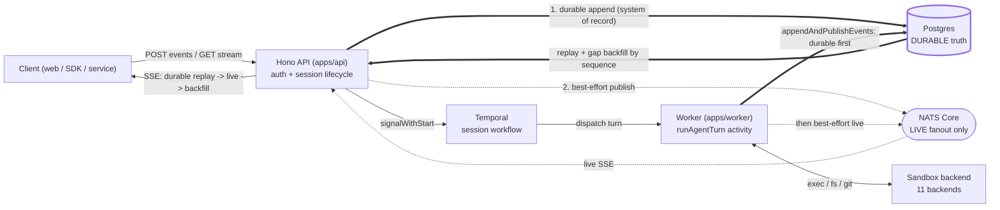

# OpenGeni architecture reference

> **This is an orientation map, not the source of truth.** It exists so an agent or human contributor can understand the whole system fast and know which rules are load-bearing *before* changing anything. **Code wins over this doc.** Where a detail here disagrees with the source, the source is right and this doc is the bug — every section names its canonical anchor so you can go check. This file complements two siblings: [`../README.md`](../README.md) (the user-facing pitch + rendered architecture diagram) and [`../AGENTS.md`](../AGENTS.md) (how to run the stack + the contributor guardrails). For the runtime behavior of a single run, read [`run-lifecycle.md`](run-lifecycle.md) and [`goals.md`](goals.md).

## How an agent should use this doc

1. **New to the repo?** Read §2 (what it is) and §3 (invariants), then skim the §6 repo map.
2. **About to change something?** Jump to §13 (*"If you're changing X, read Y first"*) — it routes you to the canonical source and the deep-dive doc for your change area.
3. **Need a wire shape, an env var, a permission, a route, a table?** Don't trust this doc's lists — they are *followers*. Go to the canonical source named in the relevant section (almost always `packages/contracts/src/index.ts`, `packages/config/src/index.ts`, `apps/api/src/app.ts`, or `packages/db/src/schema.ts`).
4. **Found this doc stale?** Fixing it is part of your change. See §15.

---

## 1. What this doc is

A single canonical map of the OpenGeni monorepo: the system shape, the cross-cutting invariants, the full repository layout, concise per-component deep-dives, and a decision table that tells you what to read before editing each area. It is deliberately dense but scannable — use the section headers and tables as an index.

It does **not** restate the run lifecycle, goal loop, deployment procedures, or capability mechanics in full; those have dedicated topic docs (§14) that go deeper and are themselves code-canonical for their topic.

---

## 2. What OpenGeni is

**OpenGeni is a self-hostable, session-based "managed agent service."** It runs OpenAI Agents SDK agents inside sandboxes and owns the durable state around them: session lifecycle, event history, human-in-the-loop approvals, long-running goals, and outputs. Public clients talk **only** to the HTTP API; everything else (orchestration, agent execution, live streaming, durable storage) is internal machinery.

**Who it's for.** Operators and product teams who want to run long-lived, side-effectful agents — infrastructure work, code changes, multi-day autonomous tasks — without building the durability, recovery, streaming, multi-tenancy, and sandbox plumbing themselves. It pairs especially well with infrastructure-focused agents (Terraform/Checkov skills and a cloud-capable sandbox ship in the box).

**The "managed agent service" framing.** OpenGeni is the *substrate*, not the agent. You bring a goal and a workspace; OpenGeni gives you:

- **A session API** — create/list/get/rename sessions, post messages, control events (approve/interrupt), and read durable history.
- **An exactly-once live stream** — SSE anchored on a per-session monotonic `sequence`, with reconnect, replay, and gap backfill.
- **Durable, recoverable runs** — runs survive worker death and provider hiccups, with no run-length limits by design.
- **A dual compute model** — *provisioned sandboxes* (disposable boxes OpenGeni creates, snapshots, and reaps across ten local/cloud backends) **and** *Connected Machines* (a user's own always-on machine, enrolled via the `selfhosted` backend, as a **first-class, co-equal PRIMARY** compute target — a machine-targeted turn runs the agent **directly on the machine** with no cloud box created, leased, or billed).
- **A multi-tenant security boundary** — workspace-scoped access with Postgres row-level security, three product access modes, and write-only secret environments.
- **Scheduled, recurring work** — cron-style scheduled tasks that wake a session and run a turn unattended.
- **Usage metering & entitlements** — per-model-call usage accounting with static or managed (Stripe) billing.

Core value props in one line: **durable + recoverable + streamable + multi-tenant + sandbox-agnostic** agent execution you can self-host.

**The product framing (from [opengeni.ai](https://opengeni.ai)).** The public pitch is *"The open agent runtime. Embed it. Self-host it. Own it."* — positioned as *"a durable, observable, interruptible agent service, with the boring infrastructure already wired in."* What that emphasis is buying you, and the lens to keep when weighing a design trade-off:

- **Data sovereignty / bring-your-own-everything.** You control your models, keys, and inference routes (OpenAI, Azure, Anthropic, Bedrock, or self-hosted) and — by enrolling a **Connected Machine** (the `selfhosted` backend) — even the machine the agent runs on, as first-class primary compute: no OpenGeni credential is shipped to it and no cloud box is created for its turns. Don't add hard dependencies on a single provider or a hosted control plane.
- **Production foundation, not a demo.** Session persistence, event replay, durable orchestration, sandboxed execution, multi-tenancy, and billing are meant to be already-wired. New features should preserve those guarantees, not bolt around them.
- **Deployment flexibility.** One runtime that ships as an *embedded library* inside another product **or** as an enterprise-wide service across AWS/Azure/GCP. Keep the client closure (`contracts → sdk → react`) embeddable and server-free (§3.9), and keep deployment provider-agnostic (§12).
- **It's substrate, not a chatbot.** OpenGeni targets teams *building* agentic products — operational control, observability, and compliance over consumer convenience. Optimize for the operator and the embedding product, not an end-user persona.

> Canonical: [opengeni.ai](https://opengeni.ai) (product vision), [`../README.md`](../README.md) (product framing + route/env surface), [`../AGENTS.md`](../AGENTS.md) (the load-bearing "do not" rules).

---

## 3. Core design principles / invariants

These are the load-bearing, cross-cutting rules. Breaking one tends to be a subtle correctness or security bug, not a compile error. Each is stated as an imperative rule with its canonical anchor.

### 3.1 Postgres is the durable source of truth; NATS is realtime fanout only

> Postgres remembers, NATS broadcasts.

- **Write durable, then publish best-effort.** `appendAndPublishEvents` writes the DB (system of record) **then** best-effort-publishes to NATS. *"The DB append above is the durable system of record; the publish is only a best-effort LIVE fan-out."* **Never publish without a prior durable append; never reverse the order.**
- **A NATS blip must never kill an in-flight turn.** `publish()` must not throw the run to death; consumers reconcile missed live events from the durable log.
- **Missed events are backfilled from Postgres by `sequence`.** The SSE stream replays durable events, subscribes live, and on a sequence gap **backfills from the DB**, deduping by sequence. The streaming core *refuses to deliver with a gap* (it throws rather than skip a missing sequence).
- **Reads never ride the bus.** Channel-A point reads go client→API→box in-process; only side-effect notifications (`fs.changed`/`git.changed`/`terminal.pty.*`) are appended+published. Putting reads on the bus would corrupt SSE gap-fill.

> Canonical: `packages/events/src/index.ts`, `apps/api/src/http/sse.ts`, `packages/sdk/src/stream.ts`.

### 3.2 Temporal coordinates; token streams never enter workflow history

- Temporal runs the long-lived per-session workflow and signals — orchestration only. **Token streams and tool output never go through workflow history.**
- The session workflow holds **no goal state in memory** — it reads/mutates `session_goals` only through activities, so the loop is replay-safe by construction.

> Canonical: `apps/worker/src/workflows/session.ts`.

### 3.3 Agent turns run as NON-retryable activities — fix idempotency, don't blind-retry

- Each turn runs as one activity with `maximumAttempts: 1` (`apps/worker/src/workflows/activities.ts`). **There is no automatic activity retry.** Model/sandbox/GitHub/cloud calls are side-effectful.
- **Do not add automatic Temporal retries around full agent turns** unless every model/tool/sandbox boundary has been made idempotent.
- Recovery is *explicit*: graceful shutdown checkpoints + requeues (status `preempted`); ungraceful death is detected via typed heartbeat/schedule-to-start timeout failures and re-dispatched via `requeueTurnAfterWorkerDeath`, **bounded by a per-turn redispatch ceiling of 3** before the session fails for real.
- Worker-death detection **must use typed SDK failure classes** (`instanceof ActivityFailure` + `TimeoutFailure.timeoutType`), never message-string matching, so it is replay-safe.

> Canonical: `apps/worker/src/activities/agent-turn.ts`, `apps/worker/src/activities/session-state.ts`, [`run-lifecycle.md`](run-lifecycle.md).

### 3.4 No run-length limits, by design — bounded by symptoms

- Runs legitimately span days. **Run length is bounded by symptoms** (no-progress detection, budget exhaustion), never by counts or clocks. **Do not add or lower caps** on model calls per turn, continuation count, or activity timeout "to be safe" — fix the pathology instead.
- Recoverable conditions **idle or explicitly resume** the session (keep context) rather than fail it: retryable provider failures, provider context overflow after bounded compaction recovery, the max-turns segment cap, and budget/credit exhaustion. A failed session would reject the very retry it asks for.
- **Failed sessions are revivable**: a new `user.message` transitions `failed → queued` and restarts the workflow (`signalWithStart`). Only `cancelled` is terminal.

> Canonical: [`run-lifecycle.md`](run-lifecycle.md), [`goals.md`](goals.md).

### 3.5 Three memory stores, three jobs

Reaching for the wrong store is the classic mistake.

| Store | Job | Rule |
| --- | --- | --- |
| `session_history_items` | **Conversation truth** fed to the model (default read path). | Unredacted, replay-ready, dual-written as the agent streams. Compaction **supersedes, never deletes** (`active=false`); summary inserted at fractional position `boundary - 0.5`. |
| `agent_run_states` | **Approval resume only** — the serialized SDK `RunState` blob to resume a turn paused mid-flight for a human approval. | Never use as conversation memory. |
| `session_events` | **Redacted human/audit timeline** — drives replay/SSE/UI. | Secret-redacted and lossy. **Must never be fed back to the model.** Per-session monotonic `sequence`. |

Sandbox recovery state is separate again, in `sandbox_session_envelopes` (provider handle / snapshot reference / manifest used to reattach on the next turn).

Workspace-level knowledge is a separate store again: `knowledge_memories` holds reviewed, workspace-scoped memory records with a `proposed → approved/rejected` lifecycle. Agents search only **approved** records and can propose new ones via the docs MCP tools (`memory_search`/`memory_propose`); approval stays in the workspace API/UI behind `documents:manage`. It is retrieval context, never conversation truth — do not wire session memory into it.

> Canonical: [`run-lifecycle.md`](run-lifecycle.md), `packages/db/src/schema.ts`.

### 3.6 Workspace is the access boundary + three access modes

- **The workspace is the access boundary, not the resource id.** *"The group uuid is NOT an access boundary, the workspace filter is."* Every workspace route must call `requireAccessGrant(c, deps, workspaceId, <permission>)` **before** touching data. A foreign workspace returns `null` → 404.
- **All workspace-scoped tables use forced row-level security** (RLS). The app connects as the non-superuser `opengeni_app` role and **must** run reads/writes inside an RLS context wrapper (`withWorkspaceRls`/`withAccountRls`) or rows are invisible.
- **Three product access modes** (`ProductAccessMode`): `local` (auto-bootstrap), `configured` (delegated HMAC token or bootstrap), `managed` (better-auth cookie session, delegated token, or hashed API key).
- **Two distinct auth headers**: the deployment shared key uses `x-opengeni-access-key`; product API keys and delegated tokens use `Authorization: Bearer`. Don't mix them.
- **`stream:view` is strictly broader than `sessions:read`** (the pixel plane is un-redacted), `files:write` ≠ `files:read`, `terminal:attach` ≠ `sessions:read`. Do not collapse these.

> Canonical: `packages/core/src/access/index.ts`, `packages/db/src/schema.ts`, [`environments.md`](environments.md), `SECURITY.md`.

### 3.7 The contracts package is the source of truth for wire types

- `packages/contracts/src/index.ts` is the single source of truth for **all** cross-boundary enums, zod schemas, the per-backend capability table, port constants, and the HMAC token envelope.
- The SDK hand-mirrors these types (zero runtime deps) and a **contract-parity test** pins them. `SandboxBackend` members are **additive at the end** and must stay 3-way identical across `contracts`/`sdk`/`deployment`.
- **Environment variable values, per-session MCP credential headers, and integration connection credentials are write-only end-to-end** — no schema ever carries a value back to a client. Connection bundles live in `connections.credential_encrypted` and are decrypted only by the DB token broker/refresh internals; the user-facing signal is the redacted `tool.auth_needed` event.

> Canonical: `packages/contracts/src/index.ts`, `packages/sdk/test/contract-parity.test.ts`, [`session-mcp-servers.md`](session-mcp-servers.md).

### 3.8 A Connected Machine is first-class PRIMARY compute — never cold-create, clone onto, or kill it

A **Connected Machine** (the `selfhosted` backend) is a user's own physical machine, not a swappable "backend #11." When it is the turn's *effective* compute target it is the **primary** compute — the agent runs on it directly.

- **Machine-primary, not a phantom box.** A machine-targeted turn (`machinePrimary` in `agent-turn.ts`) establishes the `SelfhostedSession` **directly** (`establishSelfhostedTurnSession`) and takes the group lease with backend `selfhosted` — it does **not** call `resumeBoxForTurn`, so **no Modal/cloud box is created, leased, or billed** for that turn. Warm-seconds meter off the *effective* backend (`selfhosted` = 0 rate), never the session's home backend (billing a Modal box the turn never touched would be a real money bug).
- **No OpenGeni credential crosses to the machine.** The env mint skips the GitHub-App installation token for a `selfhosted`-effective turn (`sandboxEnvironmentForRun({ skipGitHubToken })`), and selfhosted `exec` puts `env: {}` on the wire — structurally the token never reaches the machine, which uses its **own** git auth.
- **Repos are never cloned onto a machine.** `repositoryUsesSandboxClone` returns `false` for a `selfhosted` effective backend (the clone-guard) — the machine already owns its filesystem, so a platform `git clone` must never land on the user's real disk.
- **Per-session working directory, not a fixed `/workspace`.** A machine runs under `sessions.working_dir` (migration 0027); `toMachinePath` re-anchors the virtual `/workspace` frame onto the chosen host path (default = the agent's launch `workspace_root`). The "`/workspace` for every run" assumption holds only for provisioned boxes.
- **An offline agent is *not* a `NotFound`** — `isSelfhostedProviderNotFoundError` always returns `false`, because treating offline as NotFound would cold-create a rival box.
- The reaper **drains a self-hosted lease to cold but never provider-stops it** (no client build, resume, persist, delete, or kill). Checked on both `lease.backend` and `resumeBackendId`.
- The descriptor is `persistable: false` (no snapshot) and the box is never idle-reaped. The whole feature is gated OFF by default (`OPENGENI_SANDBOX_SELFHOSTED_ENABLED`); when off, enrollment routes return **404 (not 403)** — *the route is invisible, not forbidden*.

> Canonical: `apps/worker/src/activities/agent-turn.ts` (the `machinePrimary` branch), `apps/worker/src/activities/environment.ts` (`skipGitHubToken`), `packages/runtime/src/index.ts` (`repositoryUsesSandboxClone`), `packages/runtime/src/sandbox/selfhosted/session.ts` (`toMachinePath`), `apps/worker/src/activities/sandbox-lease.ts`, [`../AGENTS.md`](../AGENTS.md).

### 3.9 Other cross-cutting rules worth internalizing

- **Resumed (non-owned) boxes are never closed.** A provider session's `close()` calls `terminate()` — it **kills the box**. The API's in-process resume/Channel-A path (`apps/api/src/sandbox/channel-a.ts`, `apps/api/src/sandbox/viewer.ts`) injects a NON-OWNED handle and drops it via `dropEstablishedHandle`, a genuine no-op (`void established`) — *the lease owns lifecycle, the reaper owns teardown*. Only the reaper terminates at refcount 0, past the drain grace. (Do not look for `dropEstablishedHandle` in `packages/sdk` — it lives in the API's in-process path, not the SDK.)
- **Sandbox create is tracked before setup.** A worker that wins `cold -> warming` must persist the provider instance id on the lease immediately after provider create returns, before readiness/display/setup. If later setup fails, it terminates the just-created sandbox before retrying. A turn waiting on another worker's warming lease is bounded by `OPENGENI_SANDBOX_WARMING_TIMEOUT_MS` (default 600000) and fails clearly on capacity/create timeout instead of heartbeating forever. The Modal reaper also performs a provider-side orphan sweep for the configured app, using lease/group attribution tags or age for unattributed sandboxes.
- **Never terminate a box whose `/workspace` snapshot could not be captured** — a `persistWorkspace` failure re-throws *before* any terminate.
- **Lease epochs are integers (`int4`), deliberately not bigint** — postgres.js returns `int8` as a JS string, breaking strict epoch-fence comparisons.
- **Sandbox-access import discipline in the API:** `apps/api` accesses sandbox symbols **only** via the agent-loop-free leaf `@opengeni/runtime/sandbox`, never the bare `@opengeni/runtime` barrel (which pulls the agent loop into the API process). Enforced by a guard test.
- **The npm publish closure is the full `@opengeni/*` runtime closure.** Stage C publishes the client packages plus the server/embed packages they need (`api-router`, `worker-bundle`, `core`, `config`, `db`, `runtime`, `events`, `storage`, `documents`, `github`, `observability`, `codex`, `agent-proto`, etc.). Leaf apps/test/deployment-only packages may stay ignored only when no publishable package depends on them. The client bundle remains stricter: `sdk` is zero-runtime-dep and `react` may only depend on `sdk` among `@opengeni/*`.

### 3.10 Client/server compatibility policy

The published clients (`@opengeni/sdk`, `@opengeni/react`) and a server build
are compatible when they share a **major version**; within a major, evolution
is **additive only** and both sides are tolerant readers:

- Servers ignore unknown request params; new params must degrade gracefully
  when absent (e.g. `compact=1` on the events route — an older server simply
  returns uncompacted pages and the client renders identically).
- Clients ignore unknown response fields and unknown event types; the react
  timeline projection is a tolerant reader by construction, pinned by the
  golden event-grammar suite in `packages/react`.
- Removing or re-typing an existing field/param/event shape is a MAJOR bump —
  of the whole release train (sdk and react versions are changeset-linked; the
  server images are tagged with the same train version).

Official server images carry the train version in `OPENGENI_SERVER_VERSION`,
surfaced on `/healthz` and `/v1/config/client` as `serverVersion` (absent on
dev/source builds). There is deliberately **no runtime version negotiation** —
the policy above plus tolerant readers is the mechanism; a client that wants to
assert compatibility reads `serverVersion` and compares majors.

---

## 4. System architecture

Public clients talk only to the **Hono API**. The API authenticates/authorizes at the workspace boundary, persists durable state to **Postgres**, drives orchestration via **Temporal**, and fans out live events over **NATS Core**. A **Temporal worker** runs each agent turn as a non-retryable activity — inside a provisioned **sandbox backend**, or **directly on a Connected Machine** (the `selfhosted` primary-compute path, §3.8).

### 4.1 Live path vs durable path

The defining design tension: a request must produce both *durable truth* (survives everything) and a *live stream* (fast, lossy, reconstructible). These are two separate paths that reconcile on `sequence`.

- **Thick arrows (`==>`) are the durable path** — the system of record. Everything else can be lost and rebuilt from it.
- **Dotted arrows (`-.->`) are the live path** — best-effort, fast, never load-bearing for correctness.
- The SSE stream **starts** from durable replay (`after` cursor), **subscribes** live, and on a sequence gap **backfills** from Postgres — so a client that misses live events never sees a gap.

### 4.2 How a request becomes an agent run (narration)

1. **Edge.** A request hits `apps/api`. Global middleware runs: CORS → observability span/metrics → the deployment access-key gate (`requireAccessKey`).
2. **Authn/authz.** The route resolves an `AccessContext` (per `productAccessMode`), then `requireAccessGrant(workspaceId, permission)` resolves a per-workspace grant. This is the workspace-scoping boundary; no workspace data is touched before it passes.
3. **Create session.** `createSessionForRequest` validates payload + resources + tools + environment + model (`assertConfiguredModel` → 422 on unknown), checks usage limits/entitlements, writes durable session/goal rows + an initial event batch, enqueues the first turn, and wakes the Temporal workflow via `signalWithStart`. A create may attach per-session third-party MCP servers with write-only encrypted headers (`CreateSessionRequest.mcpServers`); responses/events expose only metadata, and later `user.message.mcpCredentialUpdates` rotate headers for the next turn. A create may target a **Connected Machine** with `CreateSessionRequest.targetSandboxId` (+ optional `workingDir`, which is a **422 without a `targetSandboxId`**): the active-sandbox pointer is seeded at creation — race-free, committed before the worker turn can read it — so the **first** turn routes to the chosen machine and lands in its working directory; an invalid/unowned/offline target **422s** (never a silent fall-back to the default box). Canonical: `packages/core/src/domain/sessions.ts`, `packages/contracts/src/index.ts` (`CreateSessionRequest`), [`session-mcp-servers.md`](session-mcp-servers.md).
4. **Orchestrate.** The `sessionWorkflow` (id `session-<sessionId>`) claims the queued turn and dispatches the agent activity (scheduled under the legacy name `runAgentSegment` — an alias for `runAgentTurn` defined in `apps/worker/src/activities.ts` — for replay determinism; see §3.3 / §7.2).
5. **Execute.** `runAgentTurn` builds + runs the OpenAI Agents SDK stream inside a sandbox, publishes realtime events, dual-writes conversation truth to `session_history_items`, meters/bills usage per model call, and settles the turn (`idle` / `requires_action` / `failed` / `cancelled` / `preempted`).
6. **Stream back.** Events were durably appended then live-published; the client's SSE connection delivers them exactly-once, in-order, gap-free.
7. **Continue or idle.** With no queued turn and an active goal, the workflow synthesizes a continuation turn (`maybeContinueGoal`); otherwise it idles out (and `continueAsNew`s before Temporal's history limit).

---

## 5. The runtime spine — session → turn → run

### 5.1 Session → turn → run

- **Session**: a durable, long-lived conversation/workspace context (one Postgres row + a Temporal workflow). Status flows through `queued`/`running`/`requires_action`/`idle`/`failed`/`cancelled`.
- **Turn**: one unit of agent work (from a user message, a goal continuation, an approval decision, or a scheduled task), run as **one non-retryable activity**. Inside it, the SDK loop makes as many model/tool calls as the work needs.
- **Run**: the SDK execution inside a turn — the streamed agent loop in a sandbox.

### 5.2 Session/turn lifecycle

```mermaid
stateDiagram-v2
  [*] --> queued: create / user.message
  queued --> running: workflow claims turn -> runAgentTurn
  running --> requires_action: human approval needed (RunState saved)
  requires_action --> running: user.approvalDecision (replays original trigger)
  running --> idle: natural stop / max-turns / provider backpressure / budget / compacted overflow fallback
  idle --> queued: new user.message OR goal continuation
  running --> preempted: graceful shutdown OR worker death
  preempted --> queued: re-dispatch (resume notice; bounded x3)
  preempted --> failed: redispatch ceiling (3) exceeded
  running --> failed: unrecoverable error
  failed --> queued: new user.message (revivable)
  idle --> [*]: continueAsNew / shutdown (goal may stay active)
  running --> cancelled: user.interrupt (stop)
  cancelled --> [*]: terminal
```

Key transitions (canonical: `apps/worker/src/workflows/session.ts`):

- **`continueAsNew` only at the top of the loop and only when `interruptedEventId === null`** — a pending interrupt is unbacked in-memory state the new run could not reconstruct.
- **Interrupt/goal-resume use `signalWithStart`** (start-or-signal), not `getHandle().signal()` — an idle/completed session has no running execution; a plain signal throws `WorkflowNotFoundError` (the "operator-can't-stop" bug).
- **Steer interrupts** (`reason: "steer"`) cancel the running turn but do **not** pause the goal — only plain stops pause.

### 5.3 Goals & long runs

A **goal** flips the default: a session that finishes a turn with nothing queued does not idle out — the workflow synthesizes a continuation turn, and stopping becomes an explicit act (`goal_complete`/`goal_pause`). Goals are bounded by progress (`OPENGENI_GOAL_NO_PROGRESS_LIMIT`, default 3) and budget guards, **not by count**. The loop is replay-safe (goal state lives only in `session_goals`, accessed via activities). Deep dive: [`goals.md`](goals.md).

### 5.4 Memory model

See §3.5 — the three stores (`session_history_items`, `agent_run_states`, `session_events`) plus `sandbox_session_envelopes`. Conversation truth is client-side, so model calls strip provider item ids by default (`OPENGENI_OPENAI_PROVIDER_ITEM_IDS=strip`) and round-trip `reasoning.encrypted_content` instead. Deep dive: [`run-lifecycle.md`](run-lifecycle.md).

### 5.5 Worker-death recovery

- **Graceful shutdown (SIGTERM):** the activity checkpoints (conversation reconcile + sandbox envelope), requeues the turn, emits `turn.preempted`, returns status `preempted`; the workflow re-dispatches on a healthy worker.
- **Ungraceful death (heartbeat timeout):** surfaces as a typed `ActivityFailure` (not a session failure). `requeueTurnAfterWorkerDeath` re-dispatches from dual-written conversation truth, bounded by the redispatch ceiling (3).
- Neither is an automatic Temporal retry. Deep dive: [`run-lifecycle.md`](run-lifecycle.md).

### 5.6 Scheduled tasks (cron)

A **scheduled task** is a stored, cron-style trigger that wakes a session and runs a turn unattended — the same `signalWithStart` entry the live API uses, so a scheduled wake-up is just another turn through the §5.2 lifecycle. The control surface (validation, CRUD, next-fire computation) lives in `packages/core/src/domain/scheduled-tasks.ts` (exposed via `apps/api/src/routes/scheduled-tasks.ts`); the worker side that fires due tasks and dispatches the turn lives in `apps/worker/src/activities/scheduled-tasks.ts`. Scheduled-task turns get the first-party `opengeni` MCP server attached like any other turn (`withFirstPartyTools`, §7.2). **Firing is idempotent** — a re-dispatched or replayed scheduled wake-up must not double-run the task (deduped on the schedule's fire key); see [`reliability-fixes.md`](reliability-fixes.md). The deployment-conformance harness includes a scheduled-task check (§12).

> Canonical: `packages/core/src/domain/scheduled-tasks.ts`, `apps/worker/src/activities/scheduled-tasks.ts`, [`reliability-fixes.md`](reliability-fixes.md).

### 5.7 Usage metering, entitlements & billing

Each model call is metered and billed during turn execution (§4.2 step 5). Two enums in `packages/contracts/src/index.ts` parameterize this per deployment, each `"none" | "static" | "managed"`:

- **`UsageLimitsMode`** — whether usage limits are off, enforced from static config, or managed externally. `createSessionForRequest` checks limits before enqueueing the first turn (§4.2 step 3) through `packages/core/src/billing/limits.ts`, and a recoverable budget/credit exhaustion **idles** the session rather than failing it (§3.4).
- **`EntitlementsMode`** — whether feature/quota entitlements are off, statically configured, or managed.

In `managed` mode, billing integrates with **Stripe**, which is confined to `apps/api/src/routes/billing.ts` (the Stripe webhook is on the access-key exempt-path allow-list, §10). The `check-workspace-billing-static.ts` static guard (§11) enforces that Stripe usage stays inside `routes/billing.ts` and that no operational `/v1` route is unscoped. Scheduled-task and billing idempotency are covered in [`reliability-fixes.md`](reliability-fixes.md).

> Canonical: `packages/contracts/src/index.ts` (`UsageLimitsMode`/`EntitlementsMode`), `packages/core/src/billing/limits.ts`, `apps/api/src/routes/billing.ts`, `scripts/check-workspace-billing-static.ts`, [`reliability-fixes.md`](reliability-fixes.md).

---

## 6. Repository layout

The monorepo is a **Bun workspace** (`workspaces: [apps/*, packages/*]`). TS packages are consumed as **source** for internal use (`main`/`types` point at `./src/index.ts`). The Stage C npm publish matrix is the full runtime closure needed by external hosts: the client closure (`@opengeni/contracts` -> `@opengeni/sdk` -> `@opengeni/react`) plus the engine/embed closure (`@opengeni/core`, `@opengeni/api-router`, `@opengeni/worker-bundle`, and their internal `@opengeni/*` dependencies such as `config`, `db`, `runtime`, `events`, `storage`, `documents`, `github`, `observability`, `codex`, and `agent-proto`). Package manifests and `.changeset/config.json` own the exact publish/build settings; ignored packages must be leaf-only. The Rust agent is a separate Cargo workspace under `agent/`.

### 6.1 Applications (`apps/`)

| Path | Package | Role | Canonical source |
| --- | --- | --- | --- |
| `apps/api` | `@opengeni/api-router` | The public HTTP adapter/router (Hono) over `@opengeni/core`: middleware, `/v1` routes, MCP HTTP transport, SSE, and API-direct sandbox control-plane endpoints. Domain/access/billing decisions live in core; routes adapt them to HTTP. | `apps/api/src/app.ts`, `packages/core/src/access/index.ts` |
| `apps/worker` | `@opengeni/worker-bundle` | Temporal worker bundle: `createOpenGeniWorker`, the session workflow + the activities that run agent turns, bill usage, drive goals, fire scheduled tasks, manage sandbox leases, and reap idle boxes. | `apps/worker/src/index.ts`, `apps/worker/src/workflows/session.ts`, `apps/worker/src/activities/agent-turn.ts` |
| `apps/web` | `opengeni-web` | React 19 + Vite operator console. A thin shell over `@opengeni/sdk` + `@opengeni/react`. Leaf app — nothing imports it. | `apps/web/src/App.tsx`, `apps/web/src/context.tsx` |

### 6.2 Packages (`packages/`)

| Path | Package | Role | Public surface | Canonical source |
| --- | --- | --- | --- | --- |
| `contracts` | `@opengeni/contracts` | **Wire contract source of truth**: all shared enums/zod schemas, `CAPABILITY_DESCRIPTORS`, port constants, the HMAC token family. | Imported by ~everything (runtime, db, sdk, events, documents, github, storage, api, worker, web, config). | `packages/contracts/src/index.ts` |
| `config` | `@opengeni/config` | All `OPENGENI_*` settings: parse → default → validate (fail-fast) → derive. Owns `SANDBOX_REQUIRED_ENV`, sandbox preparation profiles, model/pricing resolution, secret resolvers. | `getSettings()`/`Settings`, `validateSettings`, model/pricing/secret resolvers. | `packages/config/src/index.ts` |
| `core` | `@opengeni/core` | Framework-agnostic domain/access/billing/dependency layer extracted from `apps/api`: access grants, session/domain flows, scheduled-task validators, usage limits, sandbox fleet/routing helpers, and the shared dependency types. | `AppDependencies`/`ApiRouteDeps`, `requireAccessGrant`, `createSessionForRequest`, `acceptSessionUserMessage`, `checkLimit`/`requireLimit`, scheduled-task/domain helpers. | `packages/core/src/index.ts`, `packages/core/src/dependencies.ts`, `packages/core/src/domain/sessions.ts` |
| `db` | `@opengeni/db` | Postgres data layer: Drizzle schema (46 `pgTable` declarations), forward-only SQL migrations, RLS posture, role provisioning, the typed repository API. | `createDb`, `with*Rls` wrappers, hundreds of CRUD/transactional helpers; the **tables themselves are a cross-service contract**. | `packages/db/src/schema.ts`, `packages/db/src/index.ts`, `packages/db/drizzle/` |
| `runtime` | `@opengeni/runtime` | The agent runtime: SDK agent build, model routing, input prep, streamed run, **the 11-backend sandbox abstraction**, compaction, per-call context guards, history sanitization, computer-use, bundled skills. Two entrypoints: the barrel (agent loop) and `/sandbox` (agent-loop-free leaf). | `createProductionAgentRuntime()`, `runAgentStream`, `buildOpenGeniAgent`; leaf: `createSandboxClient`, `establishSandboxSessionFromEnvelope`, `PROVIDER_REGISTRY`. | `packages/runtime/src/index.ts`, `packages/runtime/src/sandbox/index.ts` |
| `events` | `@opengeni/events` | Realtime NATS transport: session fanout, the selfhosted control-plane request/reply, the auth-callout responder + NATS JWT minting, `appendAndPublishEvents`, `formatSse`. | `createNatsEventBus`, `appendAndPublishEvents`, `formatSse`, `mintUserJwt`/`mintAuthResponse`. | `packages/events/src/index.ts`, `packages/events/src/nats-jwt.ts` |
| `storage` | `@opengeni/storage` | S3/Azure/GCS object-storage abstraction: presigned URLs + trusted direct PUT for file bytes and recordings. | `createObjectStorage(settings)` → `ObjectStorage \| null`, `createPutUrl`/`createGetUrl`/`putObject`/`getFileBytes`. | `packages/storage/src/index.ts` |
| `documents` | `@opengeni/documents` | RAG pipeline: upload → parse → chunk → embed → hybrid retrieval (pgvector cosine + Postgres FTS keyword, `hybrid`/`vector`/`keyword` modes) with source-kind/ACL-tag filters over document bases. | `createDocumentServices`, `indexDocumentNow`, `searchDocuments`. | `packages/documents/src/index.ts` |
| `github` | `@opengeni/github` | GitHub App: manifest-creation flow, OAuth/installation binding, JWT + short-lived installation tokens, repo listing, bot identity, HMAC CSRF state. | `createGitHubAppInstallationToken`, `listGitHubAppRepositories`, `createSignedState`/`verifySignedState`, `githubAppBotIdentity`. | `packages/github/src/index.ts` |
| `observability` | `@opengeni/observability` | Structured logging, OTLP/HTTP JSON span export, Prometheus counters/histograms. True leaf (no workspace deps). | `createObservability`, `Observability` (`startSpan`/`recordHttpRequest`/`prometheusMetrics`). | `packages/observability/src/index.ts` |
| `deployment` | `@opengeni/deployment` | Deployment contract source of truth: 12 profiles, overlays, required-env/preflight/stack-plan/runtime-artifact logic. | `contractForProfile`, `preflightChecksFor`, `stackPlanFor`, `generateRuntimeArtifacts`, `SANDBOX_REQUIRED_ENV` (parity-pinned to config). | `packages/deployment/src/index.ts` |
| `agent-proto` | `@opengeni/agent-proto` | Generated TS wire types for the selfhosted control protocol, codegen'd from `agent/proto/opengeni_agent.proto`. Control-plane side of the BYO-compute seam. | Re-exports the generated `opengeni.agent.v1` types. | `packages/agent-proto/src/index.ts` |
| `sdk` | `@opengeni/sdk` | **Published.** Zero-runtime-dep TS client: typed API methods + exactly-once SSE streaming + proxy helpers + desktop/terminal transport contracts. | `OpenGeniClient`, `streamSessionEvents`, proxy/desktop/terminal helpers. | `packages/sdk/src/client.ts`, `packages/sdk/src/stream.ts` |
| `react` | `@opengeni/react` | **Published.** React hooks + styled components over the SDK: live streaming, chat, timeline, sandbox surfaces. Connected-machine UI (machines dashboard, enrollment, status) lives on the opt-in **`@opengeni/react/machines`** subpath so the root import is the clean sandbox-only default and machine-free consumers never pull it in (the root re-exports it deprecated for back-compat, #144). | `OpenGeniProvider`, the `use*` hooks, `ChatComposer`/`MessageTimeline`/`WorkspaceDock`/etc., CSS subpath exports; `./machines` for machine UI. | `packages/react/src/index.ts`, `packages/react/src/machines.ts`, `packages/react/src/client.ts` |
| `testing` | `@opengeni/testing` | Shared test harness/fixtures (`startTestServices`, `buildSandboxImage`, `ScriptedModel`, e2e worker). | Consumed only by tests. | `packages/testing` |

**Dependency direction (high level):** `contracts` and `config` are the foundation. `db`/`runtime`/`events`/`storage`/`documents`/`github` build on them. `core` depends on those foundations/leaves for domain/access/billing logic; `apps/api` and `apps/worker` compose core with HTTP and Temporal process wiring. The **client closure** (`contracts → sdk → react`) is kept strictly server-free; `apps/web` consumes `sdk` + `react`. The Rust `agent/` and TS `agent-proto` are bound by one shared `.proto`.

### 6.3 The self-hosted agent (`agent/`) — Rust

A Cargo workspace building the box-side binary for the `selfhosted` backend. `agent/proto/opengeni_agent.proto` is the single source of truth for the control↔agent wire protocol, codegen'd to **both** Rust (prost/protox) and TS (`@opengeni/agent-proto`). Crates: `opengeni-agent` (supervisor/dispatch/enrollment/config), `opengeni-agent-platform` (the OS seam), `opengeni-agent-stream` (the shared stream codec / `ChannelKey`), `opengeni-relay` (the stateless stream-relay edge — see §6.6 / §7.11), `opengeni-agent-update` (signed self-update), `opengeni-agent-proto`. Canonical: `agent/proto/opengeni_agent.proto`, `agent/README.md`.

### 6.4 Deployment (`deploy/`)

`deploy/helm/opengeni` (the chart — owns api/web/worker/relay/migrations plus the optional Terraform Registry MCP docs service; in-chart Postgres/Temporal/NATS/MinIO are **disposable fixtures**), `deploy/terraform/{azure,aws,gcp}` (per-cloud roots), `deploy/stacks` (wrappers for deps managed outside the chart), `deploy/nats/auth-callout.conf` (BYO-compute tenancy boundary). See §12.

### 6.5 Docs, scripts, test

`docs/` (this map + topic docs, §14), `scripts/` (dev-stack, release mechanics, static guards, deployment CLIs, §11), `test/` (integration/e2e/live tiers + `source-hygiene.test.ts`).

### 6.6 The relay edge (BYO-compute data plane)

The **relay** (`opengeni-relay`) is the data-plane edge that carries live pixel (desktop) and terminal (pty) bytes for self-hosted boxes — see §7.11 for the protocol. It is owned by the Helm chart (§6.4 / §12) and sits on its own fate-isolated tier so stream load can never starve the control plane. Conceptually: the agent **dials out** as the frame *producer*, the browser viewer **dials out** as the *consumer*, and the relay splices bytes between them by channel key — it holds **no state beyond live channels** (a relay pod death drops live streams; both ends auto-reconnect and resume against the same channel key). Lease ownership stays in Postgres; the relay only routes and rate-limits.

---

## 7. Component deep-dives

### 7.1 `apps/api` — the public edge

A thin control-plane Hono app: durable state lives in Postgres, agent turns run in the worker, live fanout rides NATS. `createApp(deps)` (`apps/api/src/app.ts`) is the composition root: middleware chain + every `/v1` router. **The auth/authz boundary is in core** (`packages/core/src/access/index.ts`: `requireAccessGrant`/`requirePermission` + the `resolveAccessContext` chain per `productAccessMode`). Session lifecycle logic lives in `packages/core/src/domain/sessions.ts` (shared by routes **and** the MCP server); this is also where per-session MCP server attach/rotation is permission-gated, encrypted, and reduced to metadata before events publish. Integration connection routes live in `apps/api/src/routes/connections.ts`: CRUD exposes metadata only, manual credential writes encrypt one JSON bundle, and OAuth start/callback delegate to the MCP OAuth client in `apps/api/src/integrations/oauth-client.ts` for discovery, CIMD/DCR registration, signed PKCE state, token exchange, and tools/list verification. Scheduled-task logic lives in `packages/core/src/domain/scheduled-tasks.ts`; usage-limit admission is in `packages/core/src/billing/limits.ts`. `apps/api` routes are HTTP adapters over those core helpers, with Stripe integration still confined to `routes/billing.ts`. SSE semantics are in `http/sse.ts`. The API-direct sandbox seam (`sandbox/access.ts`, `sandbox/channel-a.ts`, `sandbox/viewer.ts`) resumes a box by id **in-process** (no Temporal/worker) for FS/Git/Terminal point ops and viewer attach, importing **only** the agent-loop-free leaf; it injects a NON-OWNED handle and drops it with the `dropEstablishedHandle` no-op (§3.9) so it never kills a resumed box.

Critical route discipline (canonical: `routes/sessions.ts`):
- `requireAccessGrant` **before** any Zod parse; explicit `HTTPException(400)` on parse failure (never a raw `ZodError` → 500); `HTTPException(409)` on an epoch fence.
- The desktop-stream **consent gate** must match exactly between the `GET /stream-capabilities` read path and the `POST /viewers` attach path — drift is an un-redacted-pixel-plane bypass.
- `parentSessionId` comes only from the worker-signed grant claim, never caller-supplied (cross-session write escalation otherwise).
- `firstPartyMcpPermissions` can never out-rank the creating grant.

### 7.2 `apps/worker` — orchestration + execution

Hosts `sessionWorkflow` (turn loop, signals, `continueAsNew`, interrupt/approval/preempt/worker-death handling) and the activities. **Replay-determinism traps**: the workflow schedules the **legacy** activity name `runAgentSegment` (an alias `runAgentSegment: runAgentTurn` defined in `apps/worker/src/activities.ts`, and consumed by the workflow as `activity.runAgentSegment` in `apps/worker/src/workflows/session.ts`); new branches are gated by `patched()`. Note the two same-named files: the alias is in `apps/worker/src/activities.ts`, while `maximumAttempts: 1` lives in `apps/worker/src/workflows/activities.ts`. `RunAgentTurnResult.status` of `cancelled` makes the workflow continue, while `failed` makes it exit *without* calling `failSession` (the activity already marked it). The first-party `opengeni` MCP server is attached to **every** turn (`withFirstPartyTools`), including scheduled-task turns (§5.6). Per-session third-party MCP servers are loaded after capability/Codex overlays and before `runtime.prepareTools`; only this worker path decrypts their stored headers. The same prep call supplies the connection-token broker and `tool.auth_needed` publisher for capability MCP servers that carry a `connectionRef`; I1 resolution accepts workspace-shared connections only.

**Sandbox lease lifecycle** (the P1.2 ownership inversion, gated by `sandboxOwnershipEnabled`, default OFF): per-turn the worker acquires the group lease, resumes the one box by id, injects it **NON-OWNED** (so the SDK never reaps it — "the keystone"), heartbeats the TTL, and releases on finish (`release()` never stops the box). The **single global reaper** (`reapSandboxLeases`) is the sole liveness/GC/cost-stop driver — epoch-fenced CAS on both ends, **never** provider-stops a selfhosted box. One global task queue, one reaper schedule. **Machine-primary branch (Stage D, §3.8):** when the effective backend resolves to a Connected Machine, the worker skips `resumeBoxForTurn` entirely — it establishes the `SelfhostedSession` directly (`establishSelfhostedTurnSession`), takes the group lease as `selfhosted`, and bills zero warm-seconds; there is **no phantom Modal box** behind the machine.

### 7.3 `apps/web` — operator console

Bootstraps `/v1/config/client`, resolves the auth mode, gates, then loads access context + workspaces. The only bespoke HTTP it owns is client-config bootstrap + Better Auth `/v1/auth/*`; everything else goes through the SDK. Routes are **hand-written** in `App.tsx` (TanStack Router generation is OFF). `context.tsx` is the cross-route hub. Almost all session/streaming logic lives in `@opengeni/react`, not here. Watch-outs: `/clear-view` is local/this-device-only; stale-bundle auto-reload on revision mismatch; one GitHub installation per session.

### 7.4 `contracts` + `config` — the foundation

Both are single large single-file packages. `contracts` (~3148 lines) owns the enums, schemas, `CAPABILITY_DESCRIPTORS` (one row per backend, every cell `available:false + reason`, never absent), port constants (`DESKTOP_STREAM_PORT=6080`, `TERMINAL_STREAM_PORT=7681`), the access/usage/entitlements enums (`ProductAccessMode`, `UsageLimitsMode`, `EntitlementsMode`), and four HMAC token families (`ogd_`/`oge_`/`ogs_`/`ogr_`) sharing **one** envelope distinguished only by prefix. `config` (~2035 lines) parses every `OPENGENI_*` var, owns `SANDBOX_REQUIRED_ENV` (validated for the active backend only) and sandbox preparation profiles, and enforces boot invariants (lease cadence ordering, modal idle-vs-hard-lifetime, managed-mode secrets, storage exclusivity). Boolean flags must use `EnvBoolean`, never `z.coerce.boolean()`.

### 7.5 `core` — domain/access/billing

`@opengeni/core` is the extracted, framework-agnostic server layer. It owns the access resolver (`packages/core/src/access/index.ts`), dependency types (`AppDependencies`, `ApiRouteDeps`, `SessionWorkflowClient`), domain helpers (`createSessionForRequest`, `acceptSessionUserMessage`, scheduled-task/environment/pack/capability/workspace-member logic), and billing admission (`checkLimit`/`requireLimit`/`recordWorkspaceUsage`). It deliberately still throws Hono `HTTPException` in this extraction pass; typed transport-neutral errors are a later cleanup. `apps/api` imports core and adapts it to HTTP, while the first-party MCP server and embedded hosts can call the same core functions directly.

### 7.6 `db` — Postgres data layer

Forward-only migrations under `drizzle/0000..` applied by a bespoke runner (`migrate.ts`, advisory-locked, tracked in its own `schema_migrations` table — **the `drizzle/meta/_journal.json` is stale and not authoritative**). Migrations are schema-agnostic: standalone runs in the server default schema, while embedded runs may set a target schema/search path through `migrate(databaseUrl, schema)` / `runMigrations(adminConnection, targetSchema)`. The SQL must use `current_schema()` in policy guards and avoid hard-pinning `public` except for extension/type lookup through the trailing `public` search-path entry. The schema declares **48** `pgTable`s; every workspace-scoped table carries `account_id` + `workspace_id`, FORCE RLS, and a `workspace_isolation` policy. The `connections` table stores workspace/subject-scoped third-party credential metadata plus one encrypted credential bundle; broker helpers are the only read path that decrypts it and use `(id, version)` CAS for refresh/status updates. MCP OAuth DCR client registrations are stored deployment-wide in `integration_oauth_clients` keyed by AS issuer, while consumed callback nonces live in workspace-scoped `integration_oauth_state_nonces`. Leases enforce one-box-per-group via `UNIQUE (workspace_id, sandbox_group_id)` + `FOR UPDATE` + cold→warming CAS + integer epoch fence. `index.ts` is ~6000 lines (read by offset/grep). Note: pgvector embeddings are `vector(3072)` with **no ANN index** (3072 dims exceed pgvector's HNSW limit) — the vector arm is a sequential scan; the keyword arm uses GIN FTS indexes (`document_chunks_text_fts_idx`, `knowledge_memories_text_fts_idx`).

### 7.7 `runtime` — the agent loop + sandbox abstraction

The barrel (`index.ts`, 2600+ lines) drives the SDK run: instruction composition (a non-bypassable CORE substituted into a white-label persona template), multi-provider model routing (`MultiProviderModelProvider` installed in *both* the run scope and process default), per-turn input prep, the streamed run with owned/per-run sandbox wiring, the compaction summarizer, and the per-model-call input filter that elides stale screenshots before enforcing the client-mode budget guard. MCP prep composes three auth paths: first-party delegated tokens, legacy static third-party headers, and connection-broker `connectionRef` headers with one forced refresh retry on 401 plus `tool.auth_needed` on recoverable auth failures. The **sandbox leaf** (`sandbox/index.ts`) is agent-loop-free (enforced by a test) and owns `establishSandboxSessionFromEnvelope` (the one resume/cold-restore primitive) and `PROVIDER_REGISTRY` (the 11 backends, self-tested at module load: `descriptor.backendId === client.backendId`). Selfhosted (a Connected Machine) is a structural session over `ControlRpc` (`agent.<ws>.<id>.rpc`) that re-anchors the virtual `/workspace` frame onto the machine's real filesystem via `toMachinePath`, rooted at the **per-session** `sessions.working_dir` (default = the agent's launch `workspace_root`); routing is a hot-swap proxy that re-reads the active pointer per op. Client-side compaction lands only at clean turn boundaries (orphan-safe); the request-local per-call guard handles mid-turn growth without mutating conversation truth.

### 7.8 `events`, `storage`, `documents` — infra leaves

`events`: ONE managed NATS connection with **infinite reconnect** (`maxReconnectAttempts: -1`, load-bearing — dropping it caused a prod outage), durable-first publish, plus a **separate** auth-callout responder connection. Per-workspace isolation is cryptographic: `workspaceAgentPermissions(ws)` allow-lists only `agent.<ws>.>` + `_INBOX.>` (deny-all-else). `storage`: returns `null` when s3-compatible is selected but unconfigured (feature-disabled, not an error); `putObject` is the trusted in-process twin of `createPutUrl` for split public/internal endpoint topologies. `documents`: RLS everywhere; embedding model is part of the search filter (changing it without re-indexing silently hides old chunks). Retrieval has three modes (`hybrid` default, `vector`, `keyword`); hybrid falls back to keyword-only (with a `console.warn`) when the embedder fails, so an embedding outage degrades quality rather than erroring. Documents carry source metadata (kind/URI/title/author/version) and `aclTags` — **ACL tags are caller-supplied retrieval filters, not an authorization boundary**.

### 7.9 `github` + `observability` — small leaves

`github`: gate every privileged call on full configuration; HMAC CSRF state bounded to 3600s. **Footgun:** if `OPENGENI_GITHUB_APP_MANIFEST_STATE_SECRET` is unset, the secret is random per process — set it explicitly for multi-instance deploys. GitHub Enterprise hosts are hardcoded (not supported). `observability`: prom-client sits behind the `Observability` facade; metrics remain per-process (reset on restart), so API `/metrics` reflects the API process and worker `/metrics` is served by the worker HTTP listener (`OPENGENI_WORKER_HTTP_PORT`, default 8001).

### 7.10 `sdk` + `react` — published clients

`sdk` must carry **zero runtime deps** (hand-mirrors contract types; pinned by `contract-parity.test.ts`). Streaming is exactly-once/in-order/gap-free anchored on `sequence` (backfill **throws** rather than skip). `SessionEvent.type`/`Permission`/`UsageEventType` are **open unions** — do not narrow. `react`'s optional DOM-only peers (noVNC, xterm, Pierre diffs, CodeMirror) **must be lazily imported** so SSR/non-desktop bundles stay clean. Connected-machine UI (dashboard, enrollment, status pills, metrics) is carved into the **`@opengeni/react/machines`** subpath (`src/machines.ts`) so the root import is the clean sandbox-only default and machine surfaces are opt-in (the root still re-exports them deprecated for back-compat, #144). The two are version-linked via changesets; the desktop pixel plane is consent-gated (409 until acknowledged).

### 7.11 `agent/` (Rust) + `agent-proto` + the relay

The proto is the single source of truth, codegen'd to both stacks; **generated code is never hand-edited** — edit the proto then run `agent/scripts/codegen.sh` (CI fails if the tree changed). A cross-stack round-trip test proves no drift. Field numbers are append-only; handler errors are typed values, never panics (`unsafe_code = forbid`). Subscribing to `agent.<ws>.<id>.rpc` **is** the registry. Self-update trust root is one pinned minisign key; a bad update rolls back on a failed boot health gate.

**The relay data plane.** `opengeni-relay` is a stateless **byte-pump** for live pty/desktop frames on a fate-isolated tier (§6.6). Both ends **dial out** to the relay (no inbound ports on the user's machine):
- **Dial**: `wss://<relay-host>/stream?ws=<workspaceId>&agent=<agentId>&port=<port>` (+ a `channel=<channelId>` hint from the control plane's `resolveExposedPort`). The query *is* the routing `ChannelKey`.
- **Handshake**: the first datagram from each end is a `StreamOpen` carrying the channel key, a scoped token, the role (`AGENT`|`CLIENT`), and `resume_from_seq`.
- **Per connection** the relay parses the channel-key query, requires the in-band `StreamOpen.channel` to match it (defense in depth), validates the token, acks (`StreamOpenAck`), pairs producer↔consumer by key, and splices bidirectionally with bounded ring buffers, backpressure, and per-token leaky-bucket rate limits. It **resumes from `resume_from_seq`** on reconnect (replays the bounded ring), and an epoch-fence swap-away tears down with `reason = FENCED`.

**"Two tokens, one key."** The agent and the viewer dial **independently** with **different** tokens but the **same** channel key: the agent presents its enrollment-scoped `ogr_` **producer** token (`verify_relay_token`); the viewer presents the control-plane-minted `ogs_` **stream** token (`verify_stream_token`), validated **including the lease/active-epoch fence** so a stale-epoch viewer can never reach a swapped-away box. The relay validates each side on its own merits and pairs by key — the agent never mints the viewer token. The Rust token verify is the single place the relay and the TypeScript control plane must agree on the HMAC envelope; it mirrors `packages/contracts`'s `signStreamToken`/`signRelayToken` byte-for-byte (proven by `agent/crates/opengeni-relay/tests/cross_stack_token.rs`).

### 7.12 Embedding & ports

Embedding is a **binding model**: a deployment binds host-owned concerns into OpenGeni. With all ports unset, OpenGeni runs standalone and preserves byte-identical behavior. See [`embedding.md`](embedding.md) for the detailed guide.

The current map:

- **Identity resolver chain.** `packages/core/src/access/index.ts` resolves `AccessContext` through local bootstrap, configured delegated `ogd_` bearer/bootstrap, or managed delegated/API-key/Better Auth session. V2 callers may skip HTTP and pass an `AccessGrant` to core domain functions directly.
- **Tenancy / bootstrap workspace.** `bootstrapWorkspace` in `packages/db/src/index.ts` creates or updates the external account/workspace/member mapping and returns an `AccessContext`; the workspace remains the operational boundary.
- **Entitlements / admission.** `EntitlementsPort.admitRun(input)` (`packages/contracts/src/index.ts`) is wired through worker `ActivityDependencies` and can replace local credit-balance admission for managed non-Codex turns; unset uses the local ledger/configured limits. Core API admission still runs through `requireLimit`.
- **Connection credentials.** `ConnectionCredentialsPort` can provide per-run GitHub installation tokens and sandbox secrets. FORK-7 requires each provider result to echo `workspaceId`, and the worker asserts the echo before injection. The first-party MCP `ogd_` delegated token is still self-minted from `settings.delegationSecret`, not supplied by this port.
- **Persistence.** Hosts can inject a `Database` handle or use `createDb(databaseUrl, { searchPath, rlsStrategy, userLookup })`; dedicated-schema embeds use postgres-js `search_path`, and `rlsStrategy` is `"force"` (non-owner, FORCE RLS) or `"scoped"` (host-owned role, GUCs still emitted).
- **Worker.** `createOpenGeniWorker({ settings, activityDependencies })` runs the durable Temporal worker as a separate process next to the host app; it is never optional for real agent turns.
- **EventBus binding.** API and worker must share a real broker-backed `EventBus` (`createNatsEventBus`) for cross-process live fanout and SSE. An in-memory bus only fans out inside one process and would silently break worker -> API SSE.

---

## 8. Compute & sandbox model

`OPENGENI_SANDBOX_BACKEND` selects one of the **11** `SandboxBackend` values. They are **additive at the end** and 3-way pinned across `contracts`/`sdk`/`deployment`.

| # | Backend | Kind | Notes |
| --- | --- | --- | --- |
| 1 | `docker` | Provisioned (local) | Default + usual local-dev choice. |
| 2 | `modal` | Provisioned (cloud) | The managed-overlay default; swappable box. |
| 3 | `local` | Provisioned (local) | `backendId` **must** be `unix_local` (the resume-fence field). |
| 4 | `none` | In-process | No sandbox; in-process run (Model instance survives only here). |
| 5 | `daytona` | Provisioned (cloud) | |
| 6 | `runloop` | Provisioned (cloud) | |
| 7 | `e2b` | Provisioned (cloud) | |
| 8 | `blaxel` | Provisioned (cloud) | |
| 9 | `cloudflare` | Provisioned (cloud) | |
| 10 | `vercel` | Provisioned (cloud) | |
| 11 | `selfhosted` | **Connected Machine (bring-your-own-compute)** | A user's own always-on machine — **first-class, co-equal PRIMARY compute**, not merely a swappable box. A machine-targeted turn establishes the session **directly on the machine** (no cloud box created/leased/billed). Never cold-created/killed; `persistable:false`; per-session `working_dir`; controlled over NATS `ControlRpc`, not a provider API; gated OFF by default. |

**Two compute modes, co-equal.** The other ten backends are boxes OpenGeni provisions, snapshots, and reaps (docker/local locally, the cloud providers remotely; `none` is an in-process run with no box); the eleventh, `selfhosted`, is a **Connected Machine** — a user's own machine, **first-class PRIMARY compute**, not "backend #11 on a swappable list." A machine-targeted turn (`machinePrimary` in `agent-turn.ts`) establishes the `SelfhostedSession` **directly** via `establishSelfhostedTurnSession` and takes the group lease as `selfhosted` — it does **not** `resumeBoxForTurn`, so no Modal/cloud box is ever created, leased, or billed for that turn (warm-seconds meter off the *effective* backend, `selfhosted` = 0). The platform ships the machine **no OpenGeni credential** (the GitHub-App token mint is skipped and selfhosted `exec` sends `env: {}` — the machine uses its **own** git auth) and **never clones a repo onto it** (`repositoryUsesSandboxClone` → `false`). A machine runs under a **per-session working directory** (`sessions.working_dir`, migration 0027): `toMachinePath` re-anchors the virtual `/workspace` frame onto the chosen host path (default = the agent's launch dir), so the "`/workspace` for every run" assumption holds only for provisioned boxes, not machines. See §3.8. Capability cells are static per-backend metadata in `CAPABILITY_DESCRIPTORS` (one row per backend; `persistable ⇒ snapshot.kind !== 'none'`; `Recording.available === DesktopStream.available`).

**Capability packs.** An enabled capability pack can scope the runtime per workspace: a pack manifest may declare `skills` (delivered into the `.agents/` skill index alongside bundled skills) and a `sandboxImage` that replaces the global image for that workspace. **At most one enabled pack per workspace may declare an image — no image composition in v1** (second enable → 409). Built-in packs never declare images or skills. See [`packs.md`](packs.md).

**Bundled skills.** Eight skill directories ship in `packages/runtime/src/bundled_hashicorp_terraform_skills/` (vendored HashiCorp Terraform skills + repo-local `checkov` and `social-media-marketing`), mounted under `.agents/`. They are staged into a `.opengeni/` copy under cwd when packaged outside cwd. Refresh procedure: that directory's `README.md` + `UPSTREAM_GIT_SHA`.

> Canonical: `packages/contracts/src/index.ts` (the enum + `CAPABILITY_DESCRIPTORS`), `packages/runtime/src/sandbox/providers/index.ts` (the registry), `apps/worker/src/activities/agent-turn.ts` (the `machinePrimary` establish branch), `packages/runtime/src/sandbox/selfhosted/session.ts` (`toMachinePath`), [`../AGENTS.md`](../AGENTS.md) (Sandbox Notes).

---

## 9. Data & storage

- **Event store.** `session_events` is the redacted, append-only, per-session-monotonic-`sequence` human/audit timeline (the replay/SSE source). Every payload passes through `sanitizeEventPayload` (NUL + lone-surrogate repair) before insert or the jsonb write can reject the row and kill a turn.
- **Three memory stores + envelope.** See §3.5: `session_history_items` (model truth), `agent_run_states` (approval resume), `session_events` (audit), and `sandbox_session_envelopes` (sandbox recovery). Workspace knowledge memory (`knowledge_memories`, human-reviewed) is separate again — see §3.5.
- **pgvector documents.** `document_bases`/`documents`/`document_chunks` with `embedding vector(3072)`. No ANN index (vector search is a sequential scan; keyword search uses a GIN FTS index); embedding model is stored per chunk and filtered on at search time. Documents carry source metadata + `aclTags` (retrieval filters, not authz); `knowledge_memories` stores reviewed workspace memory with its own FTS index.
- **Object storage.** `s3-compatible` (MinIO local), `aws-s3`, `azure-blob`, `gcs` for file bytes + recordings. Presigned URLs are **host-bound** (host is part of the S3 signature) — the public endpoint and the in-Docker `minio:9000` endpoint are not interchangeable; use `putObject` for server-side writes on split topologies.
- **RLS posture.** Every workspace-scoped table has FORCE RLS + a `workspace_isolation` policy. The app runs as the non-superuser `opengeni_app` role inside an RLS context wrapper that sets the `opengeni.account_id`/`opengeni.workspace_id` GUCs. A query that skips the wrapper silently returns **zero rows** (not an error). Workspace env-var values live only as AES-256-GCM ciphertext and are never returned by any API.

> Canonical: `packages/db/src/schema.ts`, `packages/db/drizzle/`, `packages/storage/src/index.ts`, `packages/documents/src/index.ts`.

---

## 10. Security & access model

- **Workspace scoping.** Canonical protected routes carry the `workspaceId` in the URL; every request resolves to an access grant + permission before route code touches workspace data. The workspace filter (RLS) is the boundary, not the resource id. No operational `/v1` route may be unscoped (a static guard enforces this).
- **Three product access modes.** `local` (auto-bootstrap; dev), `configured` (delegated HMAC token or bootstrap; `x-opengeni-subject` carries the subject), `managed` (Better Auth cookie session, delegated token, or hashed API key; SaaS).
- **The deployment shared-key boundary.** `x-opengeni-access-key` gates the whole deployment (with an exempt-path allow-list: `config/client`, auth, Stripe webhook, GitHub callbacks, install). This is a *different header* from product/delegated `Authorization: Bearer`.
- **Billing/entitlements surface.** Usage limits and entitlements are governed by `UsageLimitsMode`/`EntitlementsMode` (§5.7); Stripe is confined to `routes/billing.ts` and the Stripe webhook is on the access-key exempt-path allow-list. The `check-workspace-billing-static.ts` guard enforces both confinement and route-scoping.
- **Sandbox preparation profiles + env allowlist (footgun).** `OPENGENI_SANDBOX_PREPARATION_PROFILES` (`none`/`azure`/`github`/…) and `OPENGENI_SANDBOX_ENV_ALLOWLIST` can make host credentials available **inside agent sandboxes**. Prefer short-lived credentials; review `.env` before live sessions. **No model provider credentials appear in the sandbox unless explicitly allowed.**
- **Write-only environments and session MCP credentials.** No API response, event, log, span, or audit record ever contains a workspace environment variable value or a per-session MCP header value; both are AES-256-GCM-encrypted under `OPENGENI_ENVIRONMENTS_ENCRYPTION_KEY` held outside Postgres. **Agents cannot self-attach secrets** — the worker's default first-party MCP token never carries `environments:use`/`manage` or `mcp_servers:attach`; a stronger token exists only when the creator granted it at creation (`firstPartyMcpPermissions`), capped by the creating grant. (Residual: `agent_run_states` may still contain echoed values — RLS-protected, never API-returned, deliberately not redacted so resume works.)
- **Env layering precedence (fixed):** deployment allowlist < git identity < workspace environment < run-scoped GitHub auth (later wins); reserved/loader-injection names are rejected.
- **Cryptographic per-workspace NATS isolation.** Each agent connection is scoped by a signed JWT to `agent.<ws>.>` + `_INBOX.>`; the auth-callout fails closed (a responder bug never grants access).
- **Relay token isolation.** The pixel/terminal data plane is gated by two distinct HMAC tokens (`ogr_` producer, `ogs_` viewer) over a shared channel key, with the viewer token fenced on the active lease epoch (§7.11) — a stale-epoch viewer can never reach a swapped-away box.

> Canonical: `packages/core/src/access/index.ts`, `apps/api/src/http/auth.ts`, `SECURITY.md`, [`environments.md`](environments.md), [`session-mcp-servers.md`](session-mcp-servers.md), `deploy/nats/auth-callout.conf`.

---

## 11. Build, test & release

- **Bun workspace.** `workspaces: [apps/*, packages/*]`; shared strict TS baseline in `tsconfig.base.json` (`strict`, `noUncheckedIndexedAccess`, `exactOptionalPropertyTypes`, Bundler resolution, `@opengeni/* → packages/*/src` aliases).
- **Dev stack.** `bun run dev` (= `scripts/dev-stack.sh`): copy `.env`, pick free ports, `docker compose up` Postgres/NATS/Temporal/MinIO, migrate, build the sandbox image, launch api+worker+web. It auto-selects alternate ports if defaults are taken.
- **Test tiers.** `test`/`test:unit` (bun test, **no infra**), `test:integration` (a fixed enumerated list of `*.integration.ts`), `test:e2e` (browser harness + Docker sandbox + Channel-A), `test:live` (opt-in via `OPENGENI_ENABLE_LIVE_TESTS`). **Unit tests and typecheck require no Temporal/NATS/Postgres/sandbox/model credentials** — keep new unit tests in that tier.
- **Typecheck/check/prep.** `typecheck` is a hand-ordered `cd`-chain (add new packages to it). `check` = typecheck + unit + build sdk/react + web build; `check:full`/`prep` add integration + e2e; `check:workspace-billing` adds the static auth/billing guard.
- **Static guards (build steps).** `scripts/publish-closure-guard.ts` (full npm closure has no ignored-package runtime dependencies; `sdk`/`react` remain client-clean), `scripts/check-workspace-billing-static.ts` (no unscoped `/v1` routes; Stripe only in `routes/billing.ts`, Better Auth only under `auth/`), `scripts/check-docs-refs.ts` (current-tier docs reference existing repo paths and workspace packages), `source-hygiene.test.ts` (no raw NUL bytes).
- **Changesets / publish.** Releases publish via **npm `changeset publish`** (bun can't emit provenance). Committed publishable `package.json` entry points point at `./src/...` (CI builds from source before `dist` exists); `build-publishable-packages.ts`, `rewrite-entry-points.ts`, and `rewrite-workspace-deps.ts` derive the publishable set from workspace manifests + `.changeset/config.json`, then build, swap to `dist`, and rewrite workspace ranges only in the ephemeral CI checkout. `sdk` + `react` are version-linked; package manifests and `.changeset/config.json` own which leaf packages stay ignored.
- **CI.** `ci.yml` (typecheck + unit + guards + package/image builds + deployment-artifact validation; asserts no floating `latest` tags), `release.yml` (changesets Version-PR/publish + GHCR images, dormant until `RELEASE_ENABLED=true`), `agent-ci.yml`/`agent-release.yml` (Rust agent, path-filtered, independently versioned via `agent-v*` tags).

> Canonical: `package.json`, `tsconfig.base.json`, `.changeset/config.json`, `scripts/release-publish.sh`, `.github/workflows/*`, [`../AGENTS.md`](../AGENTS.md) (Verification).

---

## 12. Deployment

A typed `DeploymentContract` (`@opengeni/deployment`) turns an abstract profile into validated deploy plans: required env, preflight checks, Terraform/Helm targets, and generated artifacts. **12 built-in profiles** (local-compose, local-kubernetes, kubernetes-external, {azure,aws,gcp}-{managed,existing-services}, preview-pr, preview-branch, self-contained-kubernetes) + **product overlays** (none / managed-saas-staging / managed-saas-production, which hard-override sandbox→modal and access→externalGateway).

- **What OpenGeni owns vs disposable fixtures.** The chart (`deploy/helm/opengeni`) owns **api/web/worker/relay/migrations**, plus optional app-adjacent integrations such as the Terraform Registry MCP docs service. The in-chart **Postgres/Temporal/NATS/MinIO are disposable conformance fixtures** (default `enabled:false`) — *not production services*. Official NATS/Temporal are lifecycle-managed by the stack wrappers (`deploy/stacks`), outside the app chart; official Temporal needs an **existing** Postgres.
- **Secrets never reach Helm values.** `generateRuntimeArtifacts` puts sensitive Terraform outputs only into `runtime.env` (and records them in `sensitiveTerraformOutputsUsed`); generated files carry "Do not commit generated copies."
- **Parity (not import).** `@opengeni/deployment`'s `SANDBOX_REQUIRED_ENV` and `SandboxBackend` *mirror* `@opengeni/config`/`@opengeni/contracts` — enforced by **tests, not the type system**. Edit one side without the other and it compiles but the parity test goes red.
- **Conformance.** `scripts/deployment-conformance.ts` black-box-verifies a running deployment (health, access boundary, session run, SSE replay, MCP-tool session, scheduled task, storage round-trip). Preflight is `scripts/deployment-preflight.ts`.

> Canonical: `packages/deployment/src/index.ts`, `deploy/helm/opengeni/`, `deploy/terraform/{azure,aws,gcp}/`, `deploy/stacks/`, [`deployment.md`](deployment.md).

---

## 13. If you're changing X, read Y first

| If you're changing… | Read first (canonical) | And the deep dive |
| --- | --- | --- |
| The session workflow / turn loop / continueAsNew | `apps/worker/src/workflows/session.ts` | [`run-lifecycle.md`](run-lifecycle.md) |
| The agent turn activity (streaming, billing, history dual-write) | `apps/worker/src/activities/agent-turn.ts` | [`run-lifecycle.md`](run-lifecycle.md) |
| The activity registry / the `runAgentSegment` alias | `apps/worker/src/activities.ts` (alias) vs `apps/worker/src/workflows/activities.ts` (`maximumAttempts:1`) | [`run-lifecycle.md`](run-lifecycle.md) |
| Worker-death / preempt / requeue | `apps/worker/src/activities/session-state.ts` | [`run-lifecycle.md`](run-lifecycle.md) |
| Goals / continuation loop | `apps/worker/src/activities/goals.ts` | [`goals.md`](goals.md) |
| Scheduled tasks / cron | `packages/core/src/domain/scheduled-tasks.ts`, `apps/worker/src/activities/scheduled-tasks.ts` | [`reliability-fixes.md`](reliability-fixes.md) |
| Usage limits / entitlements / Stripe billing | `packages/contracts/src/index.ts` (`UsageLimitsMode`/`EntitlementsMode`), `packages/core/src/billing/limits.ts`, `apps/api/src/routes/billing.ts` | [`reliability-fixes.md`](reliability-fixes.md) |
| Any cross-boundary wire type / enum / permission | `packages/contracts/src/index.ts` | `packages/sdk/test/contract-parity.test.ts` |
| Any `OPENGENI_*` setting / default / boot validation | `packages/config/src/index.ts` | — |
| DB schema / a new table / RLS | `packages/db/src/schema.ts`, `packages/db/drizzle/0001_*.sql` (RLS infra) | — |
| A migration | `packages/db/src/migrate.ts` (ordering is filename, not `_journal.json`) | — |
| Auth / authz / access modes | `packages/core/src/access/index.ts`, `apps/api/src/http/auth.ts` | `SECURITY.md` |
| HTTP routes / middleware | `apps/api/src/app.ts`, `apps/api/src/routes/sessions.ts` | — |
| SSE / streaming semantics | `apps/api/src/http/sse.ts`, `packages/sdk/src/stream.ts` | — |
| Sandbox backends / the registry | `packages/runtime/src/sandbox/providers/index.ts`, `packages/contracts` (the enum) | [`../AGENTS.md`](../AGENTS.md) Sandbox Notes |
| Selfhosted / BYO-compute control plane | `packages/runtime/src/sandbox/selfhosted/`, `agent/proto/opengeni_agent.proto` | `docs/design/sandbox-surfacing/` |
| The relay / pixel+terminal data plane | `agent/crates/opengeni-relay/`, `apps/api/src/sandbox/viewer.ts` | `docs/design/sandbox-surfacing/` |
| Sandbox lease / reaper | `apps/worker/src/activities/sandbox-lease.ts`, `apps/worker/src/sandbox-resume.ts` | — |
| The agent loop / model routing / instructions | `packages/runtime/src/index.ts` | [`model-providers.md`](model-providers.md) |
| Context compaction | `packages/runtime/src/context-compaction.ts` | [`context-compaction.md`](context-compaction.md) |
| Secret environments | `apps/api/src/routes` + `packages/db` env-crypto | [`environments.md`](environments.md) |
| Integrations / connections / token broker | `apps/api/src/routes/connections.ts`, `apps/api/src/integrations/oauth-client.ts`, `packages/db/src/connection-token-resolver.ts`, `packages/runtime/src/index.ts` (`connectionRef`), `scripts/import-integrations-catalog.ts` (reviewed catalog snapshots) | [`integrations-design.md`](integrations-design.md) |
| Per-session MCP servers / credential rotation | `packages/contracts/src/index.ts`, `packages/core/src/domain/sessions.ts`, `apps/worker/src/activities/agent-turn.ts` | [`session-mcp-servers.md`](session-mcp-servers.md) |
| Capabilities / packs | `apps/api` capability routes | [`capabilities.md`](capabilities.md), [`packs.md`](packs.md) |
| NATS / event bus / auth-callout | `packages/events/src/index.ts`, `packages/events/src/nats-jwt.ts` | — |
| Object storage | `packages/storage/src/index.ts` | — |
| Documents / RAG / knowledge memories | `packages/documents/src/index.ts`, `apps/api/src/routes/documents.ts`, `apps/api/src/mcp/documents.ts` | — |
| GitHub App | `packages/github/src/index.ts`, `apps/api/src/routes/github.ts` | — |
| The published SDK/React surface | `packages/sdk/src/index.ts`, `packages/react/src/index.ts` | `.changeset/config.json` |
| The Rust agent / wire proto | `agent/proto/opengeni_agent.proto`, `agent/scripts/codegen.sh` | `agent/README.md` |
| Deployment (Helm/Terraform/profiles) | `packages/deployment/src/index.ts`, `deploy/helm/opengeni/` | [`deployment.md`](deployment.md) |
| Build / test / release tooling | `package.json`, `.changeset/config.json`, `.github/workflows/` | [`../AGENTS.md`](../AGENTS.md) Verification |
| The web console | `apps/web/src/App.tsx`, `apps/web/src/context.tsx` | [`command-palette.md`](command-palette.md) |

---

## 14. Map of all docs

| Doc | Covers |
| --- | --- |
| [`README.md`](README.md) | The audience-tiered docs map: canonical homes, current-vs-record rules, and freshness enforcement. |
| [`architecture.md`](architecture.md) (this file) | The whole-system map, invariants, repo layout, and the change-decision table. |
| [`run-lifecycle.md`](run-lifecycle.md) | Turns, the no-length-limit doctrine, the three memory stores, graceful-preempt vs ungraceful-death recovery, provider-item-id stripping. |
| [`goals.md`](goals.md) | Goal-driven long runs: lifecycle, the replay-safe continuation loop, no-progress/budget guards, goal MCP tools, settings. |
| [`context-compaction.md`](context-compaction.md) | Provider-aware compaction: server-side on the OpenAI platform, client-side on Azure; rendered-transcript summarization, deterministic fallback, and bounded recovery. |
| [`model-providers.md`](model-providers.md) | Multi-provider model support; per-model routing via `MultiProviderModelProvider`; responses vs chat wire APIs. |
| [`capabilities.md`](capabilities.md) | The workspace/global capability catalog; registry snapshot imports; probe-on-enable; encrypted credential headers; default tool attachment. |
| [`packs.md`](packs.md) | Capability packs: role bundles, `credentialRef` vs Postgres secrets, pack-scoped `sandboxImage` + skills (no composition). |
| [`environments.md`](environments.md) | Workspace secret environments: write-only values, no-self-attach invariant, RLS, AES-256-GCM, layering order, `firstPartyMcpPermissions`. |
| [`session-mcp-servers.md`](session-mcp-servers.md) | Per-session third-party MCP servers: create contract, `mcp_servers:attach`, encrypted headers, rotation semantics, and never-return-values invariant. |
| [`command-palette.md`](command-palette.md) | The web slash-command palette; slash commands act on session/UI and are never delivered to the model. |
| [`manager-session-robustness.md`](manager-session-robustness.md) | Manager-session failure modes and fixes (point-in-time; verification timestamps are historical). |
| [`reliability-fixes.md`](reliability-fixes.md) | Reliability bugs/fixes (bounded Temporal history, orphan repair, scheduled-task/billing idempotency). |
| [`deployment.md`](deployment.md) | Operator guide: profiles, preflight/stack plans, Helm/Terraform; the disposable-fixtures rule. |
| [`embedding.md`](embedding.md) | Host-app embedding guide: router mounting, direct core calls, ports/bindings, schema/RLS, worker, and EventBus. |
| [`connected-machines.md`](connected-machines.md) | Integrator guide for targeting, swapping, enrolling, and operating Connected Machines. |
| [`design/sandbox-surfacing/`](design/sandbox-surfacing/) | Master design dossier for swappable sandboxes / BYO-compute (including the relay edge). |
| [`design/desktop-hibernation.md`](design/desktop-hibernation.md) | Research/reference only (NOT shipped) — pause/resume/hibernation primitives across providers. |
| [`../AGENTS.md`](../AGENTS.md) | How to run the stack + the load-bearing contributor guardrails. |
| [`../README.md`](../README.md) | Product framing, the rendered architecture diagram, public route/env surface, quick start. |
| [`../SECURITY.md`](../SECURITY.md) | Security policy, the workspace access boundary, RLS posture, credential-injection caution. |

---

## 15. Keeping this current

**A stale map is a bug, not a nicety.** This doc points at canonical sources; when those move, this must move with them — in the *same change*.

You **must** update this file (and the relevant topic doc) in the same PR when you:

- add/remove/rename an **app, package, or sandbox backend**, or move a major responsibility (update §6 and §8);
- change a **load-bearing invariant** in §3, §5, §9, or §10 (e.g. the durable-first ordering, the memory-store split, the access boundary, the selfhosted "never kill" rule);
- change the **request/data-flow shape** (§4 diagram) or the **session/turn lifecycle** (§5.2 diagram);
- add a doc, or change which file is **canonical** for a change area (update §13 and §14).

What this doc **must never become**: a second source of truth for route lists, env defaults, table names, enum members, or permission names. Those live in code (`contracts`/`config`/`core`/`db`/`api`); this doc names *where* they live and *why they matter* — it deliberately follows them. If you find a list here drifting from code, delete or correct it rather than letting it lie.

When in doubt, prefer **omission over invention**: an empty cell that points at the canonical source is better than a confident-but-wrong line that sends the next agent to the wrong file.
